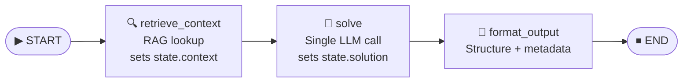
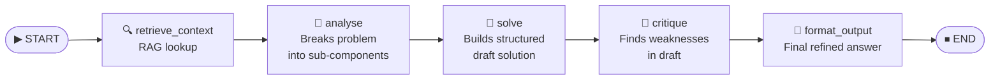
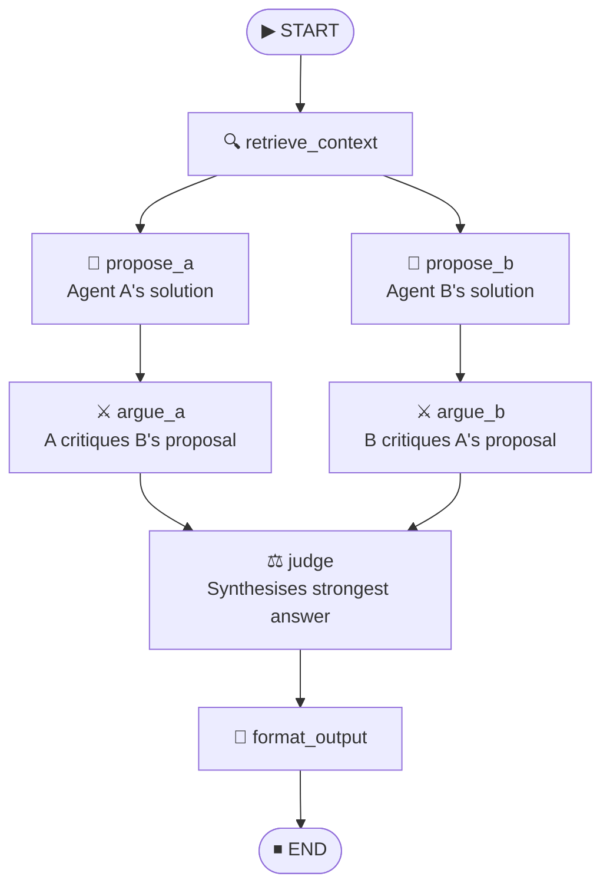
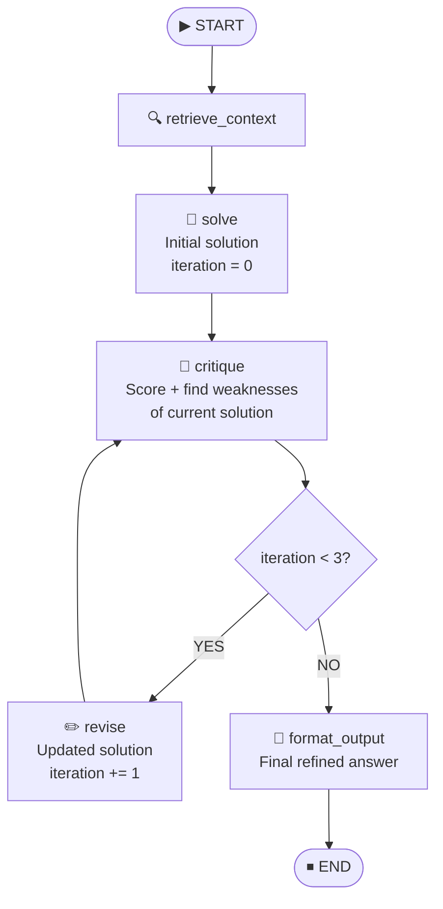

# SolveBench — Architecture Diagrams

> Visual reference for all 4 LangGraph agent architectures.  
> Each diagram shows: LangGraph nodes, state transitions, edges, and the shared `AgentState` fields used at each step.

---

## Shared AgentState Schema

All 4 architectures use the **same state object**. Not all fields are populated by every architecture.

```python
class AgentState(TypedDict):
    problem       : str    # input: the open-ended problem text
    problem_id    : str    # input: e.g. "E001", "M005", "H012"
    difficulty    : str    # input: "easy" | "medium" | "hard"
    context       : str    # set by retrieve_context node (RAG output)
    solution      : str    # final output written by last node
    intermediate  : list   # scratch pad — each arch writes its own sub-steps here
    metadata      : dict   # timing, token counts, arch name, model name
    iteration     : int    # used only by A4 (Reflection) to count critique loops
```

---

## A1 — Solo Agent *(Baseline)*

**Philosophy**: One agent, one shot. Fast, cheap, no collaboration. Everything else is measured against this.

```
INPUT PROBLEM
      │
      ▼
┌─────────────────┐
│ retrieve_context │  ← RAG: top-3 relevant chunks from FAISS index
└─────────────────┘
      │  state.context populated
      ▼
┌─────────────────┐
│     solve        │  ← Single LLM call with problem + context
└─────────────────┘
      │  state.solution populated
      ▼
┌─────────────────┐
│  format_output   │  ← Clean, structure, add metadata
└─────────────────┘
      │
      ▼
   SOLUTION
```



**State flow at each node:**

| Node             | Reads from state          | Writes to state              |
|------------------|---------------------------|-------------------------------|
| `retrieve_context` | `problem`               | `context`                    |
| `solve`          | `problem`, `context`      | `solution`, `intermediate`   |
| `format_output`  | `solution`                | `solution`, `metadata`       |

**Latency profile**: ~4–8 seconds (1 LLM call)  
**Token profile**: ~600–900 tokens total

---

## A2 — Pipeline Agents

**Philosophy**: Four specialist agents in sequence. Each does one job well. Critic catches what Solver misses.

```
INPUT PROBLEM
      │
      ▼
┌─────────────────┐
│ retrieve_context │  ← RAG retrieval (same as A1)
└─────────────────┘
      │
      ▼
┌─────────────────┐
│    analyse       │  ← Analyst breaks problem into sub-components
└─────────────────┘    writes to intermediate["analysis"]
      │
      ▼
┌─────────────────┐
│     solve        │  ← Solver reads problem + context + analysis
└─────────────────┘    writes to intermediate["draft_solution"]
      │
      ▼
┌─────────────────┐
│    critique      │  ← Critic finds weaknesses in draft solution
└─────────────────┘    writes to intermediate["critique"]
      │
      ▼
┌─────────────────┐
│  format_output   │  ← Merges critique into final solution
└─────────────────┘
      │
      ▼
   SOLUTION
```



**State flow at each node:**

| Node               | Reads from state                        | Writes to state                          |
|--------------------|------------------------------------------|------------------------------------------|
| `retrieve_context` | `problem`                               | `context`                               |
| `analyse`          | `problem`, `context`                    | `intermediate["analysis"]`              |
| `solve`            | `problem`, `context`, `intermediate`    | `intermediate["draft_solution"]`        |
| `critique`         | `problem`, `intermediate`               | `intermediate["critique"]`              |
| `format_output`    | `problem`, `intermediate`               | `solution`, `metadata`                  |

**Latency profile**: ~15–25 seconds (4 LLM calls)  
**Token profile**: ~2,000–3,500 tokens total

---

## A3 — Debate Agents

**Philosophy**: Two agents independently propose, then argue against each other's weaknesses. A Judge synthesises the strongest answer.

```
INPUT PROBLEM
      │
      ▼
┌─────────────────┐
│ retrieve_context │  ← Same RAG context given to both agents
└─────────────────┘
      │
      ├──────────────────────────────┐
      │                              │
      ▼                              ▼
┌───────────┐               ┌───────────┐
│ propose_a  │               │ propose_b  │  ← PARALLEL: both propose independently
└───────────┘               └───────────┘
      │                              │
      │  intermediate["proposal_a"]  │  intermediate["proposal_b"]
      │                              │
      ├──────────────────────────────┘
      │        (rejoin after both done)
      │
      ├──────────────────────────────┐
      │                              │
      ▼                              ▼
┌───────────┐               ┌───────────┐
│  argue_a   │               │  argue_b   │  ← PARALLEL: A critiques B's proposal, B critiques A's
└───────────┘               └───────────┘
      │                              │
      │  intermediate["argument_a"]  │  intermediate["argument_b"]
      │                              │
      └──────────────┬───────────────┘
                     │
                     ▼
           ┌─────────────────┐
           │      judge       │  ← Reads both proposals + both arguments, synthesises best answer
           └─────────────────┘
                     │
                     ▼
           ┌─────────────────┐
           │  format_output   │
           └─────────────────┘
                     │
                     ▼
                  SOLUTION
```



**State flow at each node:**

| Node               | Reads from state                                          | Writes to state                    |
|--------------------|------------------------------------------------------------|------------------------------------|
| `retrieve_context` | `problem`                                                 | `context`                          |
| `propose_a`        | `problem`, `context`                                      | `intermediate["proposal_a"]`       |
| `propose_b`        | `problem`, `context`                                      | `intermediate["proposal_b"]`       |
| `argue_a`          | `problem`, `intermediate["proposal_b"]`                   | `intermediate["argument_a"]`       |
| `argue_b`          | `problem`, `intermediate["proposal_a"]`                   | `intermediate["argument_b"]`       |
| `judge`            | `problem`, `intermediate` (all 4 above)                   | `intermediate["synthesis"]`        |
| `format_output`    | `intermediate["synthesis"]`                               | `solution`, `metadata`             |

**Latency profile**: ~25–40 seconds (6 LLM calls, 2 pairs parallelised)  
**Token profile**: ~4,000–6,000 tokens total

---

## A4 — Reflection Agent

**Philosophy**: One solver, one critic. The solver revises based on critique. Loops 3 times — does self-improvement actually converge?

```
INPUT PROBLEM
      │
      ▼
┌─────────────────┐
│ retrieve_context │
└─────────────────┘
      │
      ▼
┌─────────────────┐
│     solve        │  ← Initial solution (iteration 0)
└─────────────────┘
      │
      ▼  ◄──────────────────────────────────────┐
┌─────────────────┐                             │
│    critique      │  ← Critic scores and       │  LOOP
└─────────────────┘    identifies weaknesses    │  (max 3 iterations)
      │                                         │
      ▼                                         │
  [should continue?]  ── iteration < 3 ─────────┤ revise
  [iteration == 3?]   ── YES ──────────────────►│
                                                │
      │  (exit loop)           ┌────────────────┘
      │                        │
      ▼                        ▼
┌─────────────────┐    ┌─────────────────┐
│  format_output   │    │     revise       │  ← Solver updates solution based on critique
└─────────────────┘    └─────────────────┘
      │
      ▼
   SOLUTION
```



**State flow at each node:**

| Node               | Reads from state                            | Writes to state                           |
|--------------------|---------------------------------------------|-------------------------------------------|
| `retrieve_context` | `problem`                                   | `context`                                 |
| `solve`            | `problem`, `context`                        | `solution`, `iteration = 0`              |
| `critique`         | `problem`, `solution`                       | `intermediate["critique_N"]`             |
| `revise`           | `problem`, `solution`, `intermediate`       | `solution` (updated), `iteration += 1`   |
| `format_output`    | `solution`, `intermediate`                  | `solution`, `metadata`                   |

**Conditional edge logic:**
```python
def should_continue(state: AgentState) -> str:
    """Route back to revise or exit to format_output."""
    if state["iteration"] < 3:
        return "revise"
    return "format_output"
```

**Latency profile**: ~20–35 seconds (2 + 3×2 = 8 LLM calls)  
**Token profile**: ~3,000–5,000 tokens total

---

## Architecture Comparison Summary

| Property              | A1 Solo | A2 Pipeline | A3 Debate | A4 Reflection |
|-----------------------|---------|-------------|-----------|---------------|
| LLM calls             | 1       | 4           | 6         | 2–8 (loop)    |
| Parallelism           | No      | No          | Yes (×2)  | No            |
| Loops / iteration     | No      | No          | No        | Yes (max 3)   |
| Collaborative agents  | 1       | 4 (seq)     | 3 (2+judge)| 2 (solver+critic)|
| Expected strength     | Speed   | Completeness| Creativity| Reasoning depth|
| Expected weakness     | Shallow | Rigid order | Expensive | Low creativity |
| Approx latency        | 4–8s    | 15–25s      | 25–40s    | 20–35s        |
| Approx total tokens   | ~750    | ~2,500      | ~5,000    | ~4,000        |

---

*SolveBench — built by Phalak Mehta, IIITS*
